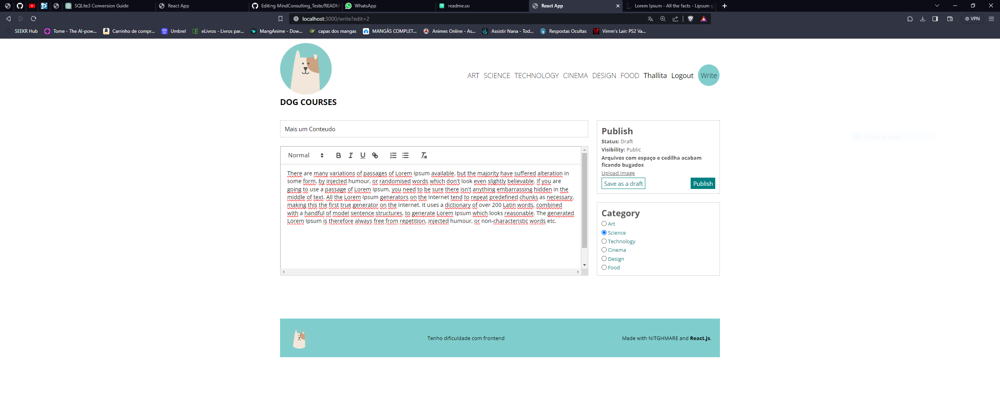

# Teste CRUD - DOG COUSES or CURSE?

Um blog post simples com login, post e edição dos mesmos.
[Incompleto - tive dificultades com a parte do frontend]


## Stack utilizada

**Front-end:** React

**Back-end:** Node, Express, bcrypt, mysql and Docker


## Rodando localmente

Clone o projeto

```bash
  git clone https://github.com/JohnPonciano/MindConsulting_Teste.git
```

Entre no diretório do projeto

```bash
  cd back
```

Instale as dependências

```bash
  npm install
```

Inicie o servidor

```bash
  npm run start
```


```bash
  Faça isso para o client também
```
    


## Screenshots

Post de terceiros:

Home:

Criação de Post:


## MYSQL + DOCKER

Tive problema com o MYSQL na minha maquina local que por algum motivo não estava subindo, mas segue script sql pra montar o DB corretamente.

Como alternativa usei o MYSQL via docker e funcinou muito bem.

Recomendo executar em algum Linux ou WSL.

```bash
  sudo start_docker.sh
```
O mesmo ira deletar qualquer banco com o nome blog, e criar um novo e já começar a execução do servidor MYSQL.
Não é necessaria a re-execução deste comando. 

Por padrão já são criado dois usuarios:

```bash
('username', 'email', 'password')
('yoda', 'yoda@example.com', 'backendsereu'),
('luke', 'luke@example.com', 'olhameusabeazul');
```

